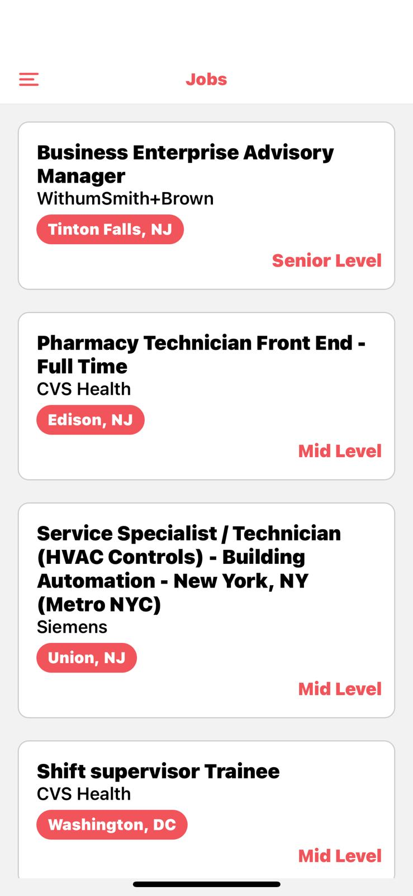
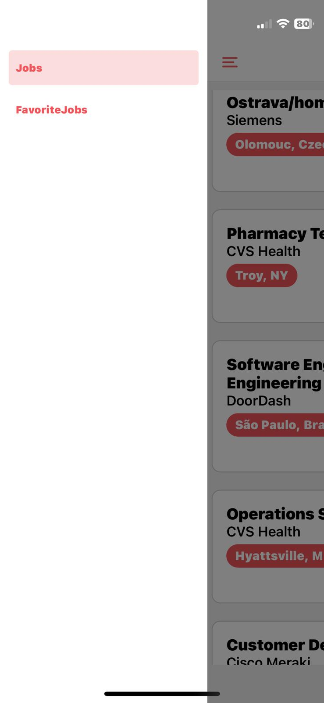
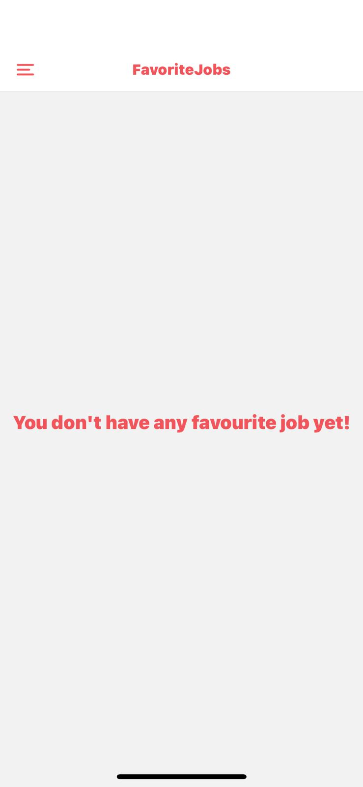
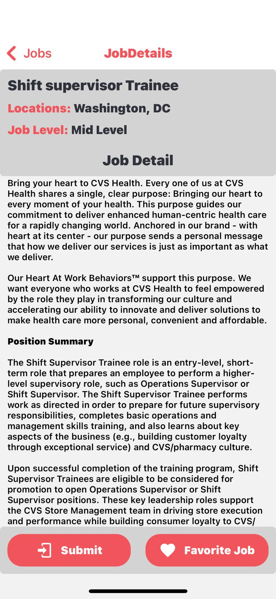
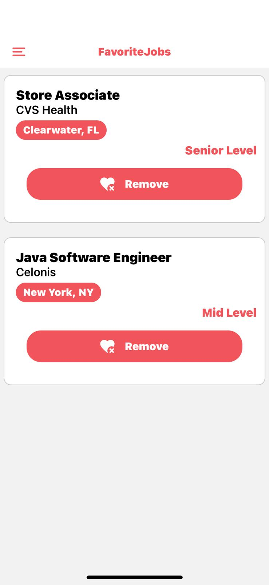

# Job Search Mobile Application: was made with React Native Framework

  <!-- iOS -->
  
  <!-- Android -->
  
  <!-- Web -->

## 🚀 How to use

> `npx create-expo my-app --example with-reanimated`

- Run `yarn` or `npm install`
- Run `yarn start` or `npm run start` to try it out.

## 📝 Notes

- [`react-native-reanimated` docs](https://docs.swmansion.com/react-native-reanimated/)

## Tools

- React-Native
- React-Redux-Toolkit
- React-Navigation
- Expo Vector Icons

## Features

- Fetches data from the API
- Users can see jobs and job details
- Users can add and remove favourite jobs

## API

- [The Muse API](https://www.themuse.com/developers/api/v2)

## Color Palette

- **Primary Color:** #4630EB
- **Secondary Color:** #F2545B
- **Background Color:** #FFFFFF
- **Text Color:** #000000

## In-App Visuals

  
  
  
  
  
  

## About

Kodwork
It's time to look for a job.

An application has been developed where users can view jobs in the sector and view job details. When the user opens the application, they can see the list of jobs, review their details and add them to their favorites or apply for a job. In the application, there are two pages called "Favorites" and "Job List" in the side-opening menu. The user can remove jobs from favorites from the favorite section.

---

# İş Arama Uygulaması: React Native Framework ile yapıldı.

  <!-- iOS -->
  
  <!-- Android -->
  
  <!-- Web -->

## 🚀 Nasıl Kullanılır

> `npx create-expo my-app --example with-reanimated`

- `yarn` veya `npm install` komutunu çalıştırın
- `yarn start` veya `npm run start` komutunu çalıştırarak uygulamayı deneyin

## 📝 Notlar

- [`react-native-reanimated` belgeleri](https://docs.swmansion.com/react-native-reanimated/)

## Araçlar

- React-Native
- React-Redux-Toolkit
- React-Navigation
- Expo Vector Icons

## Özellikler

- API'den veri çekme
- Kullanıcıların işleri ve iş detaylarını görmesi
- Kullanıcıların favori işleri ekleyip kaldırması

## API

- [The Muse API](https://www.themuse.com/developers/api/v2)

## Renk Paleti

- **Ana Renk:** #4630EB
- **İkincil Renk:** #F2545B
- **Arka Plan Rengi:** #FFFFFF
- **Yazı Rengi:** #000000

## Uygulama İçi Görseller

  
  
  
  
  
  

## Hakkında

Kodwork
Sıra geldi iş aramaya.

Kullanıcıların sektördeki işleri görüntüleyebileceği ve iş detaylarına bakabileceği bir uygulama geliştirilmiştir. Kullanıcı uygulamayı açtığında işlerin listesini görebilir, detaylarını inceleyebilir ve favorilere ekleyebilir ya da iş başvurusu yapabilir. Uygulamada yandan açılır menüde "Favori" ve "İş Listesi" adında iki sayfa bulunur. Kullanıcı favori bölümünden işleri favorilerden kaldırabilir.
